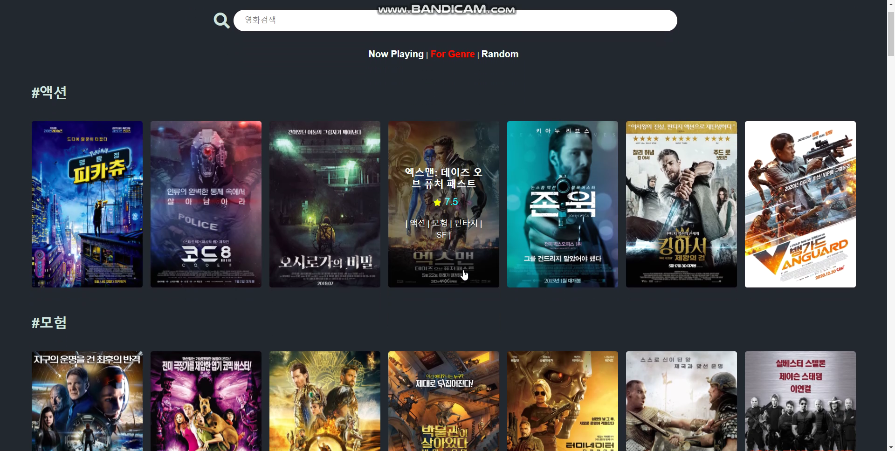

# Final Project

> 구미 1반 권순현 & 조유진 파이널 `Django`(back) + `Vue`(front) 프로젝트 !!!

## 1. 업무 분담 내역

|        | 주요 업무                           |
| ------ | ----------------------------------- |
| 권순현 | 로그인, 리뷰 게시판, 댓글, 홈페이지 |
| 조유진 | 모든 영화관련 부분, 프로필          |

> 크게 업무를 나눠서 진행했지만 서로 부족한 부분을 보완하면서 진행하였습니다. 

---

## 2. 목표 서비스 구현 및 설명

> 모든 서비스는 로그인을 해야 이용 가능.
>
> 사용자가 처음 접근할 경우 로그인 화면으로 이동하는 페이지가 제공된다.

### A. 영화정보

- 무비리스트에서 총 3가지의 영화 정보를 제공
  - 현재 상영작
  
    
  
  - 장르별 영화리스트
  
    
  
  - 랜덤 영화리스트
  
    
- 각 영화들은 Card형식으로 제공
  - 마우스 hover를 통해서 영화 제목, 평점, 장르를 확인
  - 포스터 클릭 시 영화 상세 정보 페이지로 이동
- 영화 상세정보

  

### B. 영화추천

- 회원이 작성한 리뷰 정보를 기반.

- 가장 평점을 많이 준 장르 3가지를 골라 해당 영화들을 추천.

- 4가지 장르 조합 제공.
  - 예: 액션, 드라마, SF
  - (액션, 드라마, SF), (액션, 드라마), (액션, SF), (드라마, SF) 로 제공.
  
- 해당되는 영화 수가 많을 경우 각 조합 별 14개를 랜덤으로 뽑아 제공.

  

### C. 영화검색

- 무비리스트 vue에서 검색창이 제공
  - 검색어를 입력하면 영화제목 (최대 10가지)가 표시됩니다
  - 영화제목을 클릭하면 영화 상세페이지로 이동합니다
  
  

### D. 커뮤니티

- 영화상세페이지에서 `커뮤니티 바로가기` 버튼을 통해서 이동

- 리뷰 리스트와 리뷰작성버튼이 제공

  

- 리뷰를 작성하거나 리스트에 있는 리뷰를 클릭하면 리뷰 상세페이지 이동
  - 리뷰에 대한 상세정보와 댓글기능을 제공
  
  - 평점에 따라서 제목에 표정이모티콘 제공
  
    
  
    
  
    

### E. 프로필

- 로그인 이후 오른쪽 상단의 내프로필로 접근

  

  - 작성한 리뷰에 따라서 선호하는 장르 progress 제공
  - 작성한 리뷰가 영화포스터 카드로 제공
    - 마우스 hover시 리뷰제목, 사용자 평점, 작성일 제공
    - 클릭시 리뷰 상세페이지로 이동

  

---

## 3. 데이터베이스 모델링(ERD)

### A. django 테이블

* movie : genre = M:N 관계
* movie : review = 1:N 관계
* user : review = 1:N 관계
* review : comment = 1:N 관계
* user : comment = 1:N 관계

### B. vue 컴포넌트 구조

### C. API URL

#### admin/

* 관리자 페이지

#### accounts/

* 회원정보 app

| url                 | http method | 기능                  |
| ------------------- | ----------- | --------------------- |
| signup/             | POST        | 회원 가입             |
| login/              | POST        | 로그인                |
| profile/<username>/ | GET         | 특정 유저의 회원 정보 |

#### movies/

* 영화 정보 app

| url         | http method | 기능                                          |
| ----------- | ----------- | --------------------------------------------- |
| random/     | GET         | 랜덤으로 영화 정보 35개를 가져옴.             |
| playing/    | GET         | 현재 상영 중인 영화 정보를 가져옴.            |
| genres/     | GET         | 장르 별로 7개씩의 영화 정보를 가져옴.         |
| all/        | GET         | 모든 영화의 아이디와 제목을 가져옴.           |
| <movie_id>/ | GET         | 해당 영화의 상세 정보를 가져옴.               |
| recommend/  | GET         | 현재 사용자의 추천 영화 정보를 가져옴.        |
| add/        | GET         | TMDB의 영화 정보를 DB의 저장. (사용자 제공 X) |

#### community/

| url                          | http method | 기능                                             |
| ---------------------------- | ----------- | ------------------------------------------------ |
| <movie_id>/                  | GET         | 해당 영화의 리뷰 목록을 가져옴.                  |
| <movie_id>/create/           | POST        | 해당 영화의 리뷰 작성. (로그인 한 사용자만 가능) |
| <review_id>/detail/          | GET         | 해당 리뷰의 상세 정보를 가져옴.                  |
| <review_id>/putdelete/       | PUT, DELETE | 해당 리뷰의 수정 및 삭제. (작성자만 가능)        |
| <review_id>/comment/         | GET         | 해당 리뷰의 댓글 목록을 가져옴.                  |
| <review_id>/comment/create/  | POST        | 해당 리뷰의 댓글 작성. (로그인 한 사용자만 가능) |
| comment/<comment_id>/delete/ | DELETE      | 해당 댓글을 삭제. (작성자만 가능)                |

---

## 4. 배포 서버 URL

Client : https://ssafykinesis.netlify.app/

Server : https://ssafykinesis.herokuapp.com/

---

## 5. 느낀점

- 

